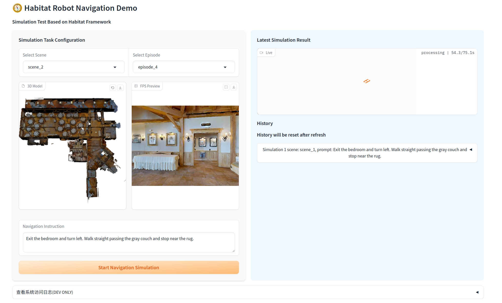
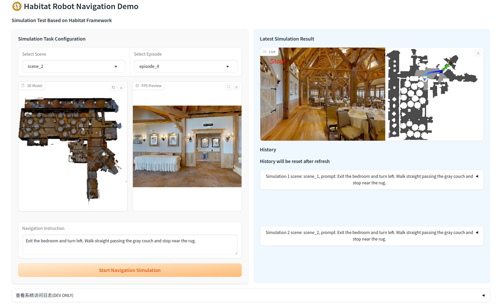

<style>
  .mytable {
    border: 1px solid rgba(128, 128, 128, 0.5);
    border-radius: 8px;        /* 四个角统一 8px 圆角 */
    border-collapse: separate; /* 必须设 separate，否则圆角会被 collapse 吃掉 */
    border-spacing: 0;
  }
  .mytable th, .mytable td {
    border: 1px solid rgba(128, 128, 128, 0.5);
    padding: 6px 12px;
  }
</style>

# Installation Guide

😄 Don’t worry — both [Quick Installation](#quick-installation) and [Dataset Preparation](#dataset-preparation) are beginner-friendly.


<!-- > 💡NOTE \
> 🙋 **[First-time users:](#-lightweight-installation-recommended-for-beginners)** Skip GenManip for now — it requires installing NVIDIA [⚙️ Isaac Sim](#), which can be complex.
Start with **CALVIN** or **SimplerEnv** for easy setup and full training/eval support.\
> 🧠 **[Advanced users:](#-full-installation-advanced-users)** Feel free to use all benchmarks, including **GenManip** with Isaac Sim support. -->

<!-- > For 🙋**first-time** users, we recommend skipping the GenManip benchmark, as it requires installing NVIDIA [⚙️ Isaac Sim](#) for simulation (which can be complex).
Instead, start with **CALVIN** or **SimplerEnv** — both are easy to set up and fully support training and evaluation. -->

<!-- This guide provides comprehensive instructions for installing and setting up the InternManip robot manipulation learning suite. Please read through the following prerequisites carefully before proceeding with the installation. -->

## Prerequisites

InternNav works across most hardware setups.
Just note the following exceptions:
- **Benchmark based on Isaac Sim** such as VN and VLN-PE benchmarks must run on **NVIDIA RTX series GPUs** (e.g., RTX 4090).

### Simulation Requirements
- **OS:** Ubuntu 20.04/22.04
- **GPU Compatibility**:
<table align="center" class="mytable">
  <tbody>
    <tr align="center" valign="middle">
      <td rowspan="2">
         <b>GPU</b>
      </td>
      <td rowspan="2">
         <b>Model Training & Inference</b>
      </td>
      <td colspan="3">
         <b>Simulation</b>
      </td>
   </tr>
   <tr align="center" valign="middle">
      <td>
         VLN-CE
      </td>
       <td>
         VN
      </td>
       <td>
         VLN-PE
      </td>

   </tr>
   <tr align="center" valign="middle">
      <td>
         NVIDIA RTX Series <br> (Driver: 535.216.01+ )
      </td>
      <td>
         ✅
      </td>
      <td>
         ✅
      </td>
      <td>
         ✅
      </td>
      <td>
         ✅
      </td>
   </tr>
   <tr align="center" valign="middle">
      <td>
         NVIDIA V/A/H100
      </td>
      <td>
         ✅
      </td>
      <td>
         ✅
      </td>
      <td>
         ❌
      </td>
      <td>
         ❌
      </td>
   </tr>
  </tbody>
</table>

```{note}
We provide a flexible installation tool for users who want to use InternNav for different purposes. Users can choose to install the training and inference environment, and the individual simulation environment independently.
```

<!-- Before installing InternManip, ensure your system meets the following requirements based on the specific models and benchmarks you plan to use. -->

### Model-Specific Requirements

<table align="center" class="mytable">
  <tbody>
    <tr align="center" valign="middle">
      <td rowspan="2">
         <b>Models</b>
      </td>
      <td colspan="2">
         <b>Minimum GPU Requirement</b>
      </td>
      <td rowspan="2">
         <b>System RAM<br>(Train/Inference)</b>
      </td>
   </tr>
   <tr align="center" valign="middle">
      <td>
         Training
      </td>
      <td>
         Inference
      </td>


   </tr>
   <tr align="center" valign="middle">
      <td>
         StreamVLN & InternVLA-N1
      </td>
      <td>
         A100
      </td>
      <td>
         RTX 4090 / A100
      </td>
      <td>
         80GB / 24GB
      </td>
   </tr>
   <tr align="center" valign="middle">
      <td>
         NavDP (VN Models)
      </td>
      <td>
        RTX 4090 / A100
      </td>
      <td>
         RTX 3060 / A100
      </td>
      <td>
         16GB / 2GB
      </td>
   </tr>
   <tr align="center" valign="middle">
      <td>
         CMA (VLN-PE Small Models)
      </td>
      <td>
         RTX 4090 / A100
      </td>
      <td>
         RTX 3060 / A100
      </td>
      <td>
         8GB / 1GB
      </td>
   </tr>
  </tbody>
</table>


## Quick Installation

Our toolchain provides two Python environment solutions to accommodate different usage scenarios with the InternNav-N1 series model:

- For quick trials and evaluations of the InternNav-N1 model, we recommend using the [Habitat environment](#habitat-environment). This option offer allowing you to quickly test and eval the InternVLA-N1 models with minimal configuration.
- If you require high-fidelity rendering, training capabilities, and physical property evaluations within the environment, we suggest using the [Isaac Sim](#isaac-sim-environment) environment. This solution provides enhanced graphical rendering and more accurate physics simulations for comprehensive testing.

Choose the environment that best fits your specific needs to optimize your experience with the InternNav-N1 model. Note that both environments support the training of the system1 model NavDP.

### Isaac Sim Environment
#### Prerequisite
- Ubuntu 20.04, 22.04
- Conda
- Python 3.10.16 (3.10.* should be ok)
- NVIDIA Omniverse Isaac Sim 4.5.0
- NVIDIA GPU (RTX 2070 or higher)
- NVIDIA GPU Driver (recommended version 535.216.01+)
- PyTorch 2.5.1, 2.6.0 (recommended)
- CUDA 11.8, 12.4 (recommended)
- Docker (Optional)
- NVIDIA Container Toolkit (Optional)

Before proceeding with the installation, ensure that you have [Isaac Sim 4.5.0](https://docs.isaacsim.omniverse.nvidia.com/4.5.0/installation/install_workstation.html) and [Conda](https://docs.conda.io/projects/conda/en/latest/user-guide/install/index.html) installed.

To help you get started quickly, we've prepared a Docker image pre-configured with Isaac Sim 4.5 and InternUtopia. You can pull the image and run evaluations in the container using the following command:
```bash
docker pull registry.cn-hangzhou.aliyuncs.com/internutopia/internutopia:2.2.0
docker run -it --name internutopia-container registry.cn-hangzhou.aliyuncs.com/internutopia/internutopia:2.2.0
```
#### Conda installation
```bash
$ conda create -n <env> python=3.10 libxcb=1.14

# Install InternUtopia through pip.(2.1.1 and 2.2.0 recommended)
$ conda activate <env>
$ pip install internutopia

# Configure the conda environment.
$ python -m internutopia.setup_conda_pypi
$ conda deactivate && conda activate <env>
```
For InternUtopia installation, you can find more detailed [docs](https://internrobotics.github.io/user_guide/internutopia/get_started/installation.html) in [InternUtopia](https://github.com/InternRobotics/InternUtopia?tab=readme-ov-file).
```bash
# Install PyTorch based on your CUDA version
$ pip install torch==2.5.1 torchvision==0.20.1 torchaudio==2.5.1 --index-url https://download.pytorch.org/whl/cu118

# Install other deps
$ pip install -r isaac_requirements.txt

```


If you need to train or evaluate models on [Habitat](#optional-habitat-environment) without physics simulation, we recommend the following setup and easier environment installation.

### Habitat Environment

#### Prerequisite
- Python 3.9
- Pytorch 2.1.2
- CUDA 12.4
- GPU: NVIDIA A100 or higher (optional for VLA training)

```bash
conda install habitat-sim==0.2.4 withbullet headless -c conda-forge -c aihabitat
git clone --branch v0.2.4 https://github.com/facebookresearch/habitat-lab.git
cd habitat-lab
pip install -e habitat-lab  # install habitat_lab
pip install -e habitat-baselines # install habitat_baselines
pip install -r habitat_requirements.txt
```


## Verification

Please download our latest pretrained [checkpoint](https://huggingface.co/InternRobotics/InternVLA-N1) of InternVLA-N1 and run the following script to inference with visualization results. Move the checkpoint to the `checkpoints` directory. Download the VLN-CE dataset from [huggingface](). The final folder structure should look like this:

```bash
InternNav/
|-- data/
|   |-- datasets
        |-- vln
        |-- vln_datasets
    |-- scene_datasets
    |-- hm3d
    |-- mp3d

|-- src/
|   |-- ...

|-- checkpoints/
|   |-- InternVLA-N1/
|   |   |-- model-00001-of-00004.safetensors
|   |   |-- config.json
|   |   |-- ...
|   |-- InternVLA-N1-S2
|   |   |-- model-00001-of-00004.safetensors
|   |   |-- config.json
|   |   |-- ...
```

Replace the 'model_path' variable in 'vln_ray_backend.py' with the path of InternVLA-N1 checkpoint.
```bash
srun -p {partition_name} --cpus-per-task 16 --gres gpu:1 python3 scripts/eval/vln_ray_backend.py
```
Find the IP address of the node allocated by Slurm. Then change the BACKEND_URL in the gradio client (navigation_ui.py) to the server's IP address. Start the gradio.
```bash
python navigation_ui.py
```
Note that it's better to run the Gradio client on a machine with a graphical user interface (GUI) but ensure there is proper network connectivity between the client and the server. Then open a browser and enter the Gradio address (such as http://0.0.0.0:5700). We can see the interface as shown below.


Click the 'Start Navigation Simulation' button to send a VLN request to the backend. The backend will submit a task to ray server and simulate the VLN task with InternVLA-N1 models. Wait about 3 minutes, the VLN task will be finished and return a result video. We can see the result video in the gradio like this.



🎉 Congratulations! You have successfully installed InternNav.


## Dataset Preparation
We also prepare high-quality data for trainning system1/system2. To set up the trainning dataset, please follow the steps below:

1. Download Datasets
- Download the [InternData-N1](https://huggingface.co/datasets/InternRobotics/InternData-N1) for:
   - `vln_pe/`
   - `vln_ce/`
   - `vln_n1/`

- Download the [SceneData-N1](https://huggingface.co/datasets/InternRobotics/Scene-N1) for the `scene_data/`.

2. Directory Structure

After downloading, organize the datasets into the following structure:

```bash
data/
├── scene_data/
│   ├── mp3d_pe/
│   │   ├──17DRP5sb8fy/
│   │   ├── 1LXtFkjw3qL/
│   │   └── ...
│   ├── mp3d_ce/
│   └── mp3d_n1/
├── vln_pe/
│   ├── raw_data/
│   │   ├── train/
│   │   ├── val_seen/
│   │   │   └── val_seen.json.gz
│   │   └── val_unseen/
│   │       └── val_unseen.json.gz
├── └── traj_data/
│       └── mp3d/
│           └── trajectory_0/
│               ├── data/
│               ├── meta/
│               └── videos/
├── vln_ce/
│   ├── raw_data/
│   └── traj_data/
└── vln_n1/
    └── traj_data/
```
