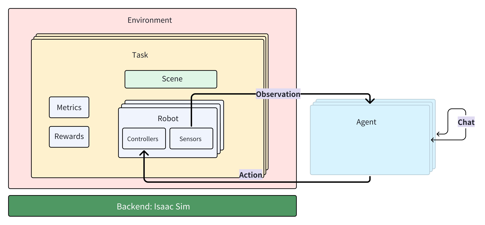

# Defining Custom Environments and Tasks in InternNav

This tutorial provided a step-by-step guide to define a new environment and a new navigation task within the InternNav framework.

---

## Overview
InternNav separates **navigation logic / policy** from **where the agent actually lives** (simulator vs real robot). The key ideas are:

- `Env`: A unified interface. All environments must behave like an `Env`.

- `Task`: A high-level navigation objective exposed to the agent, like "go to the kitchen sink" or "follow this instruction".

- `Agent`: Agent consumes observations from `Env`, predicts an action, and sends that action back to `Env`.

Because of this separation:

- We can run the same agent in simulation (Isaac / InternUtopia) or on a real robot, as long as both environments implement the same API.

- We can benchmark different tasks (VLN, PointGoalNav, etc.) in different worlds without rewriting the agent.

InternNav already ships with two major environment backends:

- **InternUtopiaEnv**:
Simulated environment built on top of InternUtopia / Isaac Sim. This supports complex indoor scenes, object semantics, RGB-D sensing, and scripted evaluation loops.
- **HabitatEnv** (WIP): Simulated environment built on top of Habitat Sim.

- **RealWorldEnv**:
Wrapper around an actual robot platform and its sensors (e.g. RGB camera, depth, odometry). This lets you deploy the same agent logic in the physical world.

Both of these are children of the same base [`Env`](https://github.com/InternRobotics/InternNav/blob/main/internnav/env/base.py) class.

## Evaluation Task (WIP)
For the vlnpe benchmark, we build the task based on internutopia. Here is a diagram.

## Evaluation Metrics (WIP)
For the VLN-PE benchmark in internutopia, InternNav provides comprehensive evaluation metrics:
- **Success Rate (SR)**: The proportion of episodes in which the agent successfully reaches the goal location within a 3-meter radius.
- **Success Rate weighted by Path Length (SPL)**: Measures both efficiency and success. It is defined as the ratio of the shortest-path distance to the actual trajectory length, weighted by whether the agent successfully reaches the goal.
A higher SPL indicates that the agent not only succeeds but does so efficiently, without taking unnecessarily long routes.
- **Trajectory Length (TL)**: The total distance traveled by the agent during an episode, measured in meters.
- **Navigation Error (NE)**: The Euclidean distance (in meters) between the agent’s final position and the goal location at the end of an episode.
- **Oracle Success Rate (OSR)**: The proportion of episodes in which any point along the predicted trajectory comes within 3 meters of the goal—representing the agent’s potential success if it were to stop optimally.
- **Fall Rate (FR)**: The frequency at which the agent falls or loses balance during navigation.
- **Stuck Rate (StR)**: The frequency at which the agent becomes immobile or trapped (e.g., blocked by obstacles or unable to proceed).

The implementation is under `internnav/env/utils/internutopia_extensions`, we highly suggested follow the guide of [InternUtopia](../../internutopia).
