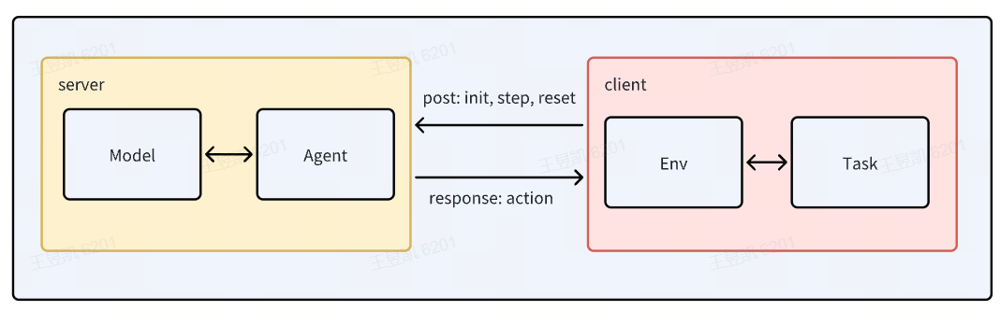

# Environments Design in InternNav

This tutorial provided a step-by-step guide to define a new environment and a new navigation task within the InternNav framework.

---

## Overview
InternNav separates **navigation logic / policy** from **where the agent actually lives** (simulator vs real robot). The key ideas are:

- `Env`: A unified interface. All environments must behave like an `Env`.

- `Task`: A high-level navigation objective exposed to the agent, like "go to the kitchen sink" or "follow this instruction".

- `Agent`: Agent consumes observations from `Env`, predicts an action, and sends that action back to `Env`.

Because of this separation:

- We can run the same agent in simulation (Isaac / InternUtopia) or on a real robot, as long as both environments implement the same API.

- We can benchmark different tasks in different worlds without rewriting the agent.

InternNav already ships with three major environment backends:

- **InternUtopiaEnv**:
Simulated environment built on top of InternUtopia / Isaac Sim. This supports complex indoor scenes, object semantics, RGB-D sensing, and scripted evaluation loops.

- **HabitatEnv**: Simulated environment built on top of Habitat Sim. This supports gym style workflow and handles distribution episodes set up.

- **RealWorldEnv**:
Wrapper around an actual robot platform and its sensors (e.g. RGB camera, depth, odometry). This lets you deploy the same agent logic in the physical world.

Both of these are children of the same base [`Env`](https://github.com/InternRobotics/InternNav/blob/main/internnav/env/base.py) class.

