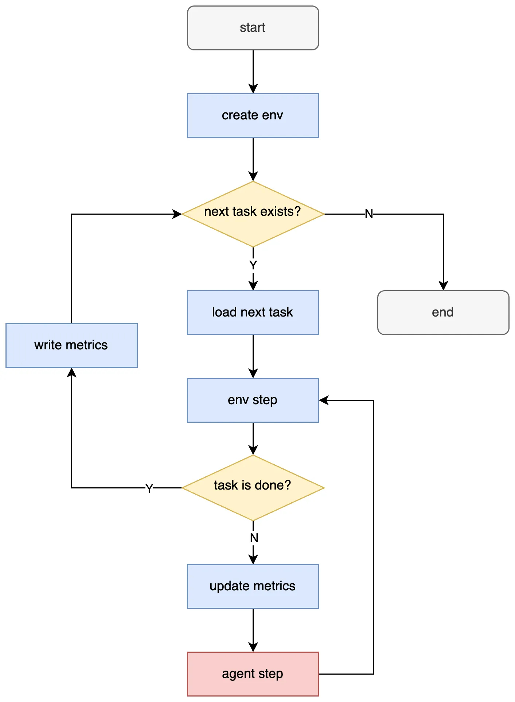

# How to Build a Benchmark

> This tutorial explains how to build a comprehensive benchmark using InternUtopia.

## 1. Understanding Benchmarks in InternUtopia

A benchmark in InternUtopia is a collection of tasks and corresponding metrics to evaluate an agent's ablity to complete these tasks. Typically, the agent drives a robot in a simulation environment with action for specific controllers, and makes decision based on observations provided by the sensors. The metrics are used to evaluate the performance of an agent's behavior.

## 2. Benchmark Components

The key components of a benchmark includes:

- Task: what the task for the agent to execute
- Metric: how to evaluate the performance of an agent's behavior
- Agent: how to generate an action from an observation

### 2.1 Task

First of all you should define a task class for the benchmark. In the benchmark one or more instances of the task class will be created and executed in the simulator.

You can refer to the [How to Add Custom Task](how-to-add-task.md) tutorial to learn how to add a custom task. The core is to implement for a task the `is_done` method to determine when the task ends. For example, the task ends when the robot reaches a certain position or reaches a certain number of steps for a navigation task.

```python
def is_done(self) -> bool:
    """
    Returns True of the task is done. The result should be decided by the state of the task.
    """
    raise NotImplementedError
```

You can also extend other methods as you see fit, but you should always include the parent implementation in the overridden method.

You can refer to the [vln_eval_task.py](https://github.com/InternRobotics/InternNav/blob/main/internnav/env/utils/internutopia_extension/tasks/vln_eval_task.py) to see the task implementation for VLN benchmark.

### 2.2 Metric

The metrics are used to evaluate the performance of an agent's behavior in each task execution. The core is to implement for a metric the `update` method to update the metric with the latest observation.

```python
@abstractmethod
def update(self, obs: dict):
    """
    This function is called at each world step.
    """
    raise NotImplementedError(f'`update` function of {self.name} is not implemented')
```

You can refer to the [How to Add Custom Metric](how-to-add-metric.md) tutorial to learn how to add a custom metric, and refer to the [vln_pe_metrics.py](https://github.com/InternRobotics/InternNav/blob/main/internnav/env/utils/internutopia_extension/metrics/vln_pe_metrics.py) to see the metric implementation for VLN benchmark.

### 2.3 Agent

The agent is responsible for generating an action from an observation. The core is to implement a method to generate an action from an observation in each step.

For example, a step method is defined to generate an action from an observation.

```python
@abstractmethod
def step(self, obs: dict) -> dict:
    """
    Generate an action from an observation.
    """
    # Agent logics here.
    return {'controller_name': action}
```

The output action should be a dict with the controller name as the key and the corresponding action as the value.

For InternUtopia there's no constraint on how the agent should look like, so you can implement an agent in any forms (a class, a function, a module, etc.)

You can find a reference implementation of agent in [Add a New Benchmark](../../internmanip/quick_start/add_benchmark.md) of InternManip documentation.


### 2.4 Others

You may want to define your own robot, controllers and sensors to meet the specific needs of the benchmark, but it is not mandatory. If it is your case, refer to the [How to Add Custom Robot](how-to-add-robot.md), [How to Add Custom Controller](how-to-add-controller.md) and [How to Add Custom Sensor](how-to-add-sensor.md) tutorials.

## 3. Run the Benchmark

The general execution procedure of a benchmark in InternUtopia is as follows:



With benchmark specific task and metrics, the config to create env looks like:

```{code-block} python
:emphasize-lines: 5,7,10,12,15

from internutopia.core.config import Config, SimConfig

config = Config(
    simulator=SimConfig(physics_dt=1 / 240, rendering_dt=1 / 240, use_fabric=False, headless=False),
    metrics_save_path='metrics.jsonl',
    task_configs=[
        MyTaskCfg(
            scene_asset_path=gm.ASSET_PATH + '/scenes/empty.usd',
            robots=[h1],
            metrics=[MyMetricCfg(...)],
        ),
        MyTaskCfg(
            scene_asset_path=gm.ASSET_PATH + '/scenes/empty.usd',
            robots=[h1],
            metrics=[MyMetricCfg(...)],
        ),
        ...
    ],
)
```

In the example above, `MyMetricCfg` is the metric configuration, and `MyTaskCfg` is the  task configuration. The `task_configs` is a list that contains all tasks that will be executed. And after all the tasks are finished, you can find the metrics in `metrics.jsonl`, where each line is the metrics for one task.

After declaring the config, we can create the environment and step it with agent generated actions:

```python
# if any extensions in internutopia_extension is used, import them before env creation.
from internutopia_extension import import_extensions
import_extensions()

# Use gym_env or vec_env based on your needs
from internutopia.core.gym_env import Env
env = Env(config)
obs, _ = env.reset()

agent = MyAgent(...) # initialize your agent here.

while env.simulation_app.is_running():
    action = agent.step(obs) # get action from observation
    obs, _, terminated, _, _ = env.step(action=action)

    if terminated:
        _, info = env.reset()
        if info is None:
            break

env.close()
```

The code above outlines the basic structure of a single-agent benchmark with [Gym Env](../tutorials/gym_env.md), corresponding to the procedure mentioned above. If multi-agent or [Vector Env](../tutorials/vec_env.md) is desired, use `internutopia.core.vec_env` instead of `internutopia.core.gym_env`. For more details about the env usages and methods, please refer to the [Gym Env tutorial](../tutorials/gym_env.md) and [Vec Env tutorial](../tutorials/vec_env.md). You can also utilize multi-gpu and/or multi-node to accerelate the benchmark execution with the guide in [Multi-GPU and Multi-Node](../tutorials/multi-gpu-and-multi-node.md).

## 4. More

In real-world benchmarks, the task configs may be assembled from a dataset, and the agent may be running on a different host. These topics are beyond the scope of this document. You can refer to the [Add a New Benchmark](../../internmanip/quick_start/add_benchmark.md) in InternManip documentation for more complex scenarios.
