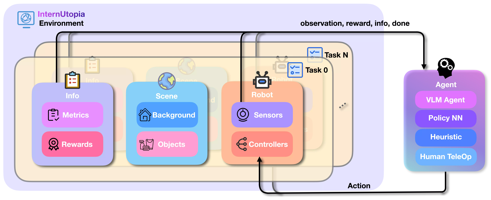

---
myst:
  html_meta:
    "description lang=en": |
      Documentation for users who wish to build sphinx sites with
      pydata-sphinx-theme.
---

# InternUtopia

This document introduces installation steps, tutorials, and reference APIs of [InternUtopia](https://github.com/InternRobotics/InternUtopia).

InternUtopia, built on NVIDIA Isaac Sim, is an embodied AI research platform. It aims to reduce the burden of engineering implementation, tackle the data scarcity in the field of embodied intelligence, and offer simulations that are more reflective of real-world scenarios.

Here is a brief overview of InternUtopia:



We provide some demostrations to show what InternUtopia can do after [installation](./get_started/installation.md):

| Name | Description | Requirement |
| --- | --- | --- |
| [🚶‍➡️Drive Unitree G1 with Keyboard](./get_started/drive-unitree-g1-with-keyboard.html) | Control a Unitree G1 robot to walk around in a simulation world with keyboard | A host with NVIDIA RTX GPU |
| [🥽Teleoperate Fourier GR1 with VisionPro](./get_started/teleoprate-fourier-gr1-with-visionpro.html) | Teleoperate a Fourier GR1 robot with a VR headset (Apple VisionPro) | * A host with NVIDIA RTX GPU <br /> * [Apple VisionPro](https://www.apple.com/apple-vision-pro/) |
| [👋Control Franka with Your Hand](./get_started/control-franak-with-your-hand.html) | Teleoperate a Franka with camera-based motion capture system | * A host with NVIDIA RTX GPU <br /> * A camera |
| [🫳Edit Scene Interactively](./get_started/edit-scene-interactively.md) | Interactively edit scene with camera-based motion capture system | * A host with NVIDIA RTX GPU <br /> * A camera |


```{toctree}
:maxdepth: 1

get_started/index
tutorials/index
advanced_tutorials/index
```
