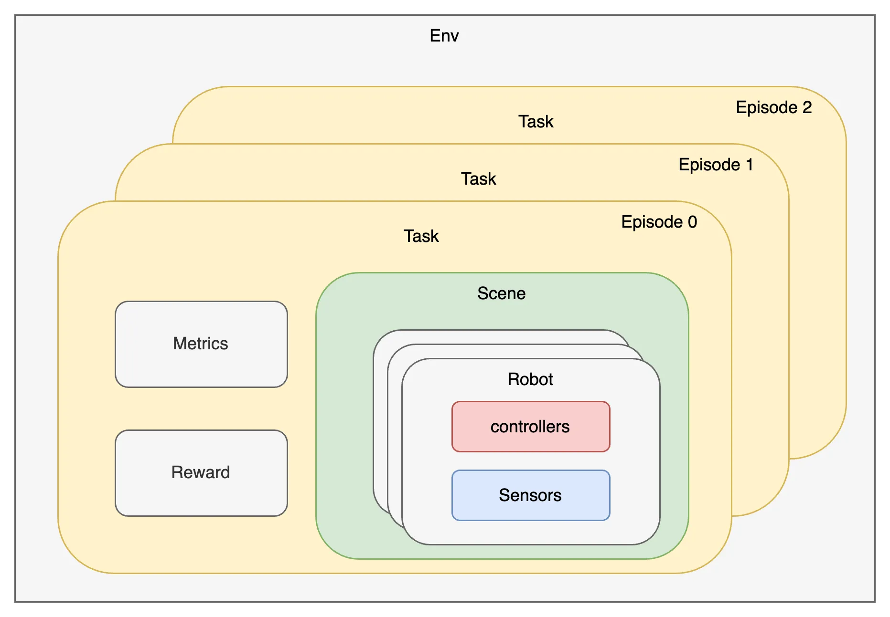
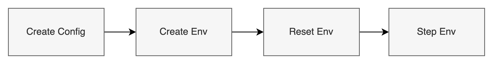
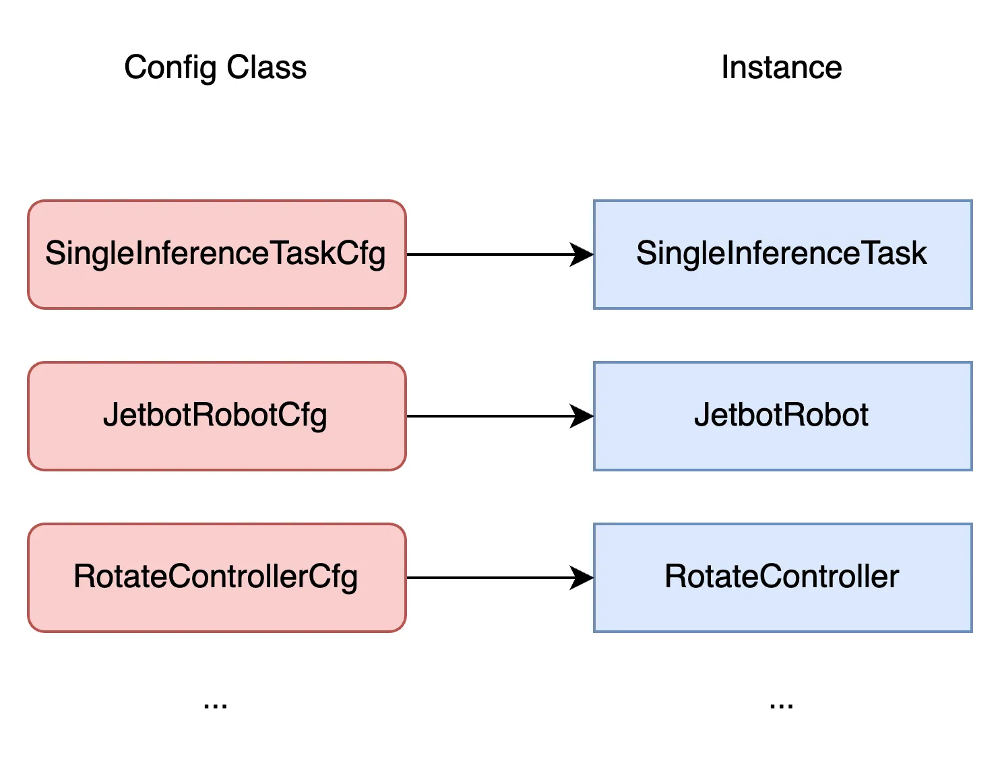

# Core Concepts

## Core Concepts



- **Env**: Env is a Reinforcement Learning Agents environment with which the agent interacts.

- **Task**: Task is an core concept within InternUtopia. The type of task indicates what goal to be achieved and what action that can be performed in the environment.

- **Episode**: One execution of a task is called an *Episode*.

- **Robot**: Robot is a controllable entity inside the environment. It is the medium for agent to interact with the environment. A robot is typically an articulation.

- **Controller**: Controller defines the way the robot can be controlled. Controllers typically manage a group of joints of a robot and serve as the entries for robot actions, and we utilize controllers to make a robot move and run. A simple example of controller is the one that accepts a list of joint torques and direct applies them to the target joint set. Another controller may accept a speed in x-axis and drive a car to move along x-axis in that speed.

- **Sensor**: Sensor is the medium for robot to get observations from environment. Each type of sensor returns a certain type of observation, such as a camera returns RGB image.

- **Metrics**: Metrics are quantitative measures used to evaluate certain aspects of a task. They are updated in every env step, and summarized when an episode ends.

- **Reward**: Reward is a score given to the agent to optimize its performance in the task. It is calculated and returned each env step.

## Main Process

The main process of simulation is as following:



The env above is a typical [`gym.Env`](https://gymnasium.farama.org/api/env/).

The minimum code to start simulation is like following:

```python
from internutopia.core.config import Config, SimConfig
from internutopia.core.gym_env import Env
from internutopia.core.util import has_display
from internutopia_extension import import_extensions
from internutopia_extension.configs.tasks import SingleInferenceTaskCfg

import_extensions()

headless = not has_display()

config = Config(
    simulator=SimConfig(physics_dt=1 / 240, rendering_dt=1 / 240, use_fabric=False, headless=headless, webrtc=headless),
    task_configs=[
        SingleInferenceTaskCfg(),
    ],
)

env = Env(config)
obs, _ = env.reset()

i = 0

while env.simulation_app.is_running():
    i += 1
    env.step(action={})

    if i % 1000 == 0:
        print(i)

env.close()
```

<video width="720" height="405" controls>
    <source src="../../../_static/video/tutorial_minimum.webm" type="video/webm">
</video>

Config must contain at least one task config. After the config is created, we can create the env to run the task in simulation. It is important to note that all the extension and packages must be imported **BEFORE** env creation to ensure all extensions can be resolved properly. In the example above, we wrap them in the `import_extensions()`.

Once the env is created, the first thing to do is to reset the env to load the first episode. And then we can step the env to run the simulation.

## Config Classes

Each kind of instance (task, robot, controller, etc) has its own config class, and we use the config class to initialize the corresponding instance in simulation.

<!--  -->

