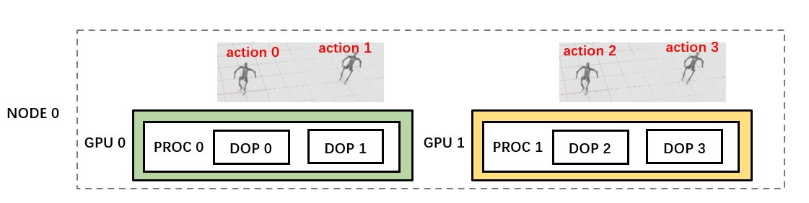
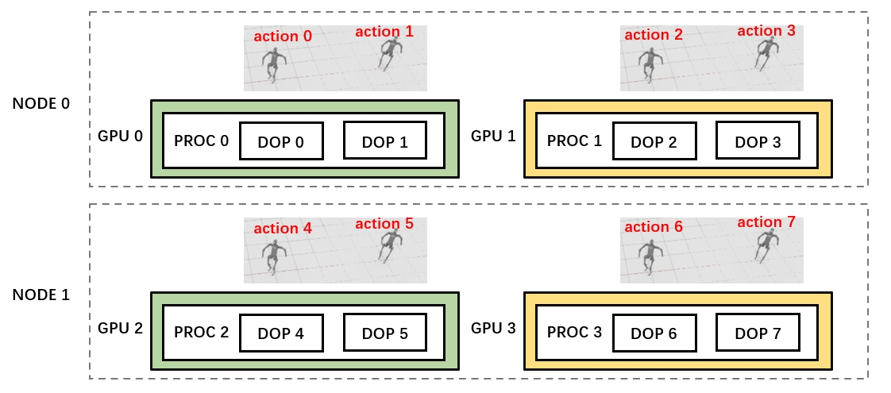

# Multi-GPU and Multi-Node

> This tutorial guides you on how to launch [Vec Env](./vec_env.md) on Multi-GPU and Multi-Node.

## Multi-GPU

Let's take 2 GPUs on 1 node as an example. The goal of each task (episode) in the following script is to create one h1 robot and wait it to walk from coordinates (0,0) to coordinates (1,1). Totally 8 episodes are to execute.

To run our code on 2 GPUs, call `config.distribute()` and pass distribution_config with proc_num set to 2 as follow:

```{code-block} python
:emphasize-lines: 26,37-42
# test.py located at /root/code
from internutopia.core.config import Config, SimConfig
from internutopia.core.vec_env import Env
from internutopia.macros import gm
from internutopia_extension import import_extensions
from internutopia_extension.configs.tasks import SingleInferenceTaskCfg
from internutopia_extension.configs.robots.h1 import (
    H1RobotCfg,
    move_along_path_cfg,
    move_by_speed_cfg,
    rotate_cfg,
)
import time

headless = True

h1 = H1RobotCfg(
    position=(0.0, 0.0, 1.05),
    controllers=[
        move_by_speed_cfg,
        move_along_path_cfg,
        rotate_cfg,
    ],
    sensors=[],
)
from internutopia.core.config.distribution import RayDistributionCfg
config = Config(
    simulator=SimConfig(physics_dt=1 / 240, rendering_dt=1 / 240, use_fabric=True, headless=headless, native=headless),
    env_num=2,
    task_configs=[
        SingleInferenceTaskCfg(
            scene_asset_path=gm.ASSET_PATH + '/scenes/empty.usd',
            scene_scale=(0.01, 0.01, 0.01),
            robots=[h1.update()],
        ) for _ in range(8)
    ]
).distribute(
    RayDistributionCfg(
        proc_num=2,
        gpu_num_per_proc=1, # can be omitted.
    )
)

import_extensions()

def get_finish_status(obs):
    if obs is None:
        return True
    return obs['h1']['controllers']['move_along_path']['finished']

env = Env(config)
obs,_ = env.reset()
# degree of parallelism
dop = len(obs)

action = {'h1':{'move_along_path': [[(0.0, 0.0, 0.0), (1.0, 1.0, 0.0)]]}}
no_more_episode = False

start = time.time()
while True:
    obs_list, _, _, _, _ = env.step(action=[action for _ in range(dop)])
    finish_status_list = [get_finish_status(obs) for obs in obs_list]

    if no_more_episode and all(finish_status_list):
        break

    if not no_more_episode and True in finish_status_list:
        env_ids = [env_id for env_id, finish_status in enumerate(finish_status_list) if finish_status]
        obs, _ = env.reset(env_ids)
        if None in obs:
            no_more_episode = True
end = time.time()
print(f"Total time:{round(end - start)} s")

env.close()

```

> **env_num** specifies the degree of parallelism in a single process.
> **proc_num** specifies the number of processes, each process will bond to A set of GPU(s).
> total_dop(degree of parallelism) = **proc_num** * **env_num**.

> use **gpu_num_per_proc** (default to 1) to config the num of gpus each process bond to and ensure **total_gpu** >=  **proc_num** * **gpu_num_per_proc** so that every process can allocate enough resources.
> Providing multiple GPUs for a process does not significantly accelerate simulation，So we suggest setting **gpu_num_per_proc** <= 1.

Each time we call the env.step method, we pass in 4 actions to control 4 robots respectively.


## Multi-Node

Let's take 4 GPUs on 2 nodes (2 GPUs on each node) as an example. The goal of each task (episode) in the following script is to create one h1 robot and wait it to walk from coordinates (0,0) to coordinates (1,1). Totally 8 episodes are to execute.
To run our code on the 4 GPUs, we need to follow the instructions on this [link](https://docs.ray.io/en/latest/cluster/vms/user-guides/launching-clusters/on-premises.html#on-prem) to start the ray cluster on two nodes:
```
# At Head Node
cd /root/code
conda activate internutopia
ray start --head --port=6379

# At Worker Node
cd /root/code
conda activate internutopia
ray start --address=<head-node-address:port>
```
Add distribution_config and call `config.distribute()` and pass distribution_config with params as follow:
```{code-block} python
:emphasize-lines: 26,37-44
# test.py located at /root/code
from internutopia.core.config import Config, SimConfig
from internutopia.core.vec_env import Env
from internutopia.macros import gm
from internutopia_extension import import_extensions
from internutopia_extension.configs.tasks import SingleInferenceTaskCfg
from internutopia_extension.configs.robots.h1 import (
    H1RobotCfg,
    move_along_path_cfg,
    move_by_speed_cfg,
    rotate_cfg,
)
import time

headless = True

h1 = H1RobotCfg(
    position=(0.0, 0.0, 1.05),
    controllers=[
        move_by_speed_cfg,
        move_along_path_cfg,
        rotate_cfg,
    ],
    sensors=[],
)
from internutopia.core.config.distribution import RayDistributionCfg
config = Config(
    simulator=SimConfig(physics_dt=1 / 240, rendering_dt=1 / 240, use_fabric=True, headless=headless, native=headless),
    env_num=2,
    task_configs=[
        SingleInferenceTaskCfg(
            scene_asset_path=gm.ASSET_PATH + '/scenes/empty.usd',
            scene_scale=(0.01, 0.01, 0.01),
            robots=[h1.update()],
        ) for _ in range(8)
    ]
).distribute(
    RayDistributionCfg(
        proc_num=4,
        gpu_num_per_proc=1, # can be omitted.
        head_address="10.150.88.28", # change to the ip address of head node, can be omitted if run the script at head node.
        working_dir="/root/code", # can be omitted if /root/code is shared storage or identical manually on all nodes.
    )
)

import_extensions()

def get_finish_status(obs):
    if obs is None:
        return True
    return obs['h1']['controllers']['move_along_path']['finished']

env = Env(config)
obs,_ = env.reset()
# degree of parallelism
dop = len(obs)

action = {'h1':{'move_along_path': [[(0.0, 0.0, 0.0), (1.0, 1.0, 0.0)]]}}
no_more_episode = False

start = time.time()
while True:
    obs_list, _, _, _, _ = env.step(action=[action for _ in range(dop)])
    finish_status_list = [get_finish_status(obs) for obs in obs_list]

    if no_more_episode and all(finish_status_list):
        break

    if not no_more_episode and True in finish_status_list:
        env_ids = [env_id for env_id, finish_status in enumerate(finish_status_list) if finish_status]
        obs, _ = env.reset(env_ids)
        if None in obs:
            no_more_episode = True
end = time.time()
print(f"Total time:{round(end - start)} s")

env.close()

```
Each time we call the env.step method, we pass in 8 actions to control 8 robots respectively.


To successfully run the script on Multi-Node, the following things need to be confirmed:
- The conda environment located in the same path on each node, for example: `/root/miniconda3/envs/internutopia`. If not, you will encounter errors like ModuleNotFoundError: No module named 'internutopia'.
- If `/root/code` is not shared storage, and `test.py` was not copied on each node manually, don't forget to set working_dir to `/root/code` so that Ray will upload the directory to `tmp/ray/` on each node, and use it as working dir. Read this [doc](https://docs.ray.io/en/latest/cluster/running-applications/job-submission/ray-client.html#uploads) for more information of working_dir.
- Run the script on the head node for better performance，if you run the script on work node or other node out of ray, the script communicate to ray cluster through a component called "Ray Client server", that will increase the data transmit time.

## Special Note

When using `config.distribute()`, several methods or properties of Env will raise **NotImplementedError**, please avoid using them, here is the list:

- env.runner
- env.simulation_app
- env.get_dt()
- env.finished()
